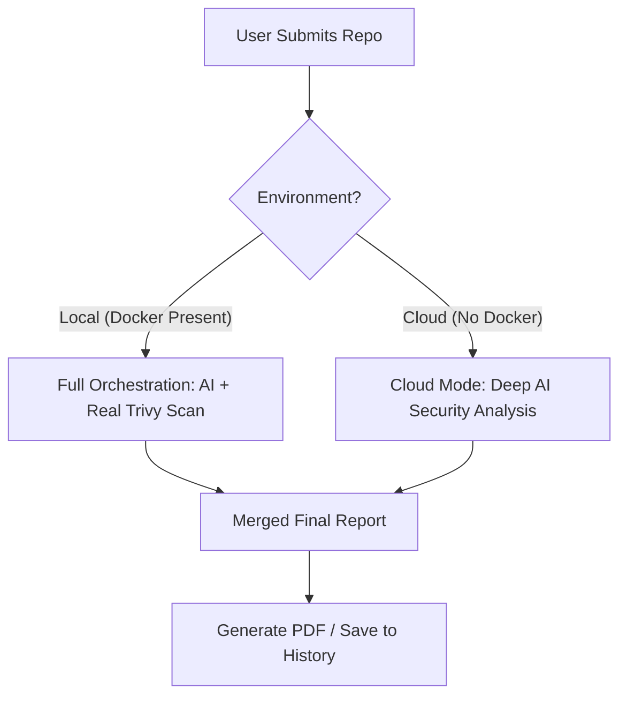

# 🛡️ DevOps Polyglot Auditor 🚀

[](https://devops-polyglot-auditor.vercel.app/)
[](https://devops-polyglot-auditor.onrender.com/health)
[](https://aistudio.google.com/)
[](https://opensource.org/licenses/MIT)

An **Ultra-Aesthetic**, AI-powered Infrastructure & Code Security Auditor. This tool performs deep architectural analysis on GitHub repositories, merging real-world containerized security scans with advanced AI-driven "Senior Engineer" reviews.

[**Live Demo**](https://devops-polyglot-auditor.vercel.app/) • [**Backend Health**](https://devops-polyglot-auditor.onrender.com/health)

---

## 💎 Premium Features & Aesthetics
The project features a **Silicon Valley-grade UI** designed for maximum visual impact and professional clarity:

### 🎨 Visual Overhaul
- **Glassmorphism:** Frosted glass components with `backdrop-blur` and dynamic borders.
- **Bento Grid:** Apple-inspired asymmetric layout for structured data visualization.
- **Animated Environment:** Interactive background blobs and a technical grid overlay.
- **Dual-Mode HUD:** Seamless Light/Dark mode transitions with persistent user preferences.

### ⚙️ Advanced Functionality
- **💻 Live Execution Terminal:** A real-time log stream that mirrors professional CI/CD output, showing every step from cloning to AI analysis.
- **🕒 Audit History:** A persistent sidebar (localStorage) to track and re-run your last 5 audits instantly.
- **📄 Professional PDF Export:** Generate and download high-quality audit reports with a single click.

---

## 🛠️ Technical Architecture

### The "Super-Hybrid" Logic
This tool is a fusion of three major DevOps concepts:

| Concept | Implementation in Polyglot Auditor |
| :--- | :--- |
| **Online Judge** | Uses **Docker Sandboxing** to run `Trivy` scans on submitted code. |
| **CI/CD Simulator** | Features a **Visual Pipeline HUD** & **Live Terminal** logs. |
| **Cloud Manager** | Uses AI to generate an **Infrastructure Preview** (S3, EC2, Docker). |

### The Stack
| Tier | Technology |
| :--- | :--- |
| **Frontend** | React 19, Tailwind CSS v3, Framer Motion, Lucide Icons, jsPDF |
| **Backend** | Node.js, Express, Simple-Git, Child Process Orchestration |
| **AI Engine** | Google Gemini 2.5 Flash (JSON Output Mode) |
| **DevOps** | Docker, Trivy Security Scanner, GitHub REST API |

---

## 🧠 Smart Environment Adaptation
The auditor is built with **Production-Grade Resilience**. It detects its environment and adapts its feature set:



---

## 🚀 Getting Started

### Prerequisites
- **Node.js** (v18+)
- **Docker Desktop** (Optional, required for real container scans)
- **Gemini API Key** ([Get it free](https://aistudio.google.com/))

### Quick Install
1. **Clone the Repo:**
   ```bash
   git clone https://github.com/wasifshaffaq/devops-polyglot-auditor.git
   ```
2. **Backend Setup:**
   ```bash
   cd backend
   npm install
   # Add GEMINI_API_KEY to .env
   npm run dev
   ```
3. **Frontend Setup:**
   ```bash
   cd frontend
   npm install
   npm run dev
   ```

---

## 📸 Portfolio Highlights
- **Asynchronous Orchestration:** Handles parallel execution of AI logic and Docker processes without blocking.
- **Logic Prioritization:** Custom file-depth sorting ensures the AI focuses on root configurations (`package.json`, `Dockerfile`) first.
- **Zero-Budget Deployment:** Engineered to run on free-tier cloud infrastructure through intelligent feature fallbacks.
- **Document Generation:** Client-side PDF generation demonstrates utility-focused engineering.

---
Developed by **Wasif Shaffaq** | *DevOps & AI Enthusiast*
