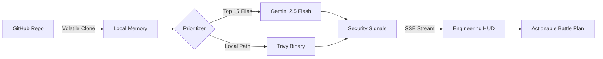

<p align="center">
  
</p>

<h1 align="center">🌑 DevOps Polyglot Auditor v2.5</h1>

<p align="center">
  <strong>Architectural Intelligence for Modern DevOps.</strong><br>
  Merging heuristic AI reasoning with deterministic container analysis into a single, motion-heavy Engineering HUD.
</p>

<p align="center">
  <a href="https://deepmind.google/technologies/gemini/flash/"></a>
  <a href="https://github.com/aquasecurity/trivy"></a>
  <a href="#-the-obsidian-theme"></a>
  <a href="https://github.com/wasifshaffaq/devops-auditor/blob/master/LICENSE"></a>
</p>

---

## ⚡ The "Aha!" Moment
> [!TIP]
> Traditional scanners find CVEs. Polyglot Auditor finds **Logic Traps**. 
> While other tools tell you your package is out of date, our engine detects if your user has the subtle permissions to delete your entire production cluster.

---

## 💎 Core Intelligence
Polyglot Auditor doesn't just scan; it **orchestrates**. It combines two world-class engines into a high-density "Engineering HUD."

### 🧠 Heuristic Reasoning (Gemini 2.5 Flash)
- **Deep Architectural Context:** Understands relationships between Terraform, Kubernetes, and Docker.
- **Privilege Escalation Detection:** Spots "sneaky" IAM and RBAC chains that pattern-matchers miss.
- **Natural Language remediation:** Provides specific, actionable "Battle Plans" instead of generic error codes.

### 🛡️ Deterministic Scanning (Trivy Engine)
- **Container Security:** Deep OS-level vulnerability detection for Docker images.
- **Dependency Trees:** Scans your `package.json` for known high-priority CVEs.
- **Zero-False Positives:** Hard-coded security signals verified against the Aquasecurity database.

---

## 📊 Comparison Matrix
| Feature | Polyglot Auditor | Standard Static Scanners |
| :--- | :---: | :---: |
| **Logic Trap Detection** | ✅ Yes | ❌ No |
| **Heuristic Reasoning** | ✅ Yes | ❌ No |
| **Real-time SSE Logs** | ✅ Yes | ❌ No |
| **Cloud-First (No API Limits)** | ✅ Yes | ⚠️ Limited |
| **Obsidian Dark Mode HUD** | ✅ Yes | ❌ No |

---

## 🏗️ The Neural Pipeline


---

## 🚀 Quick Start (60 Seconds)

> [!IMPORTANT]
> This project requires **Docker Desktop** to be running for deterministic scans.

### 1. The Foundations
```bash
# Clone the repository
git clone https://github.com/wasifshaffaq/devops-auditor
cd devops-auditor

# Setup Environment (Add your Gemini Key)
echo "GEMINI_API_KEY=your_key_here" > backend/.env

# Install the Ecosystem
npm run install-all
```

### 2. Ignition
Open 3 terminal windows and run:
1. `cd backend && npm start`
2. `cd landing && npm run dev`
3. `cd frontend && npm run dev`

---

## 🗺️ Detailed Setup (For Absolute Beginners)

<details>
<summary><b>Click to expand the Full Noob Guide</b></summary>

### 1. Software You Need
- **Node.js (v20+):** From [nodejs.org](https://nodejs.org/)
- **Git:** From [git-scm.com](https://git-scm.com/)
- **Docker Desktop:** From [docker.com](https://www.docker.com/)

### 2. Get Your API Key
1. Visit [Google AI Studio](https://aistudio.google.com/).
2. Click **"Get API Key"**.
3. Copy it and paste it into `backend/.env` like this: `GEMINI_API_KEY=AIza...`

### 3. Launch & Audit
Visit `http://localhost:3000`, click **START AUDIT**, and paste any repository link.
</details>

---

## 🌐 Cloud Architecture
The suite is now **fully containerized** and **Render-Ready**.
- **`auditor-engine`:** Dockerized Node.js + Trivy Binary.
- **`auditor-gateway`:** Next.js 15 (Optimized for Free Tier).
- **`auditor-hud`:** Static React HUD.

---

## 👨‍💻 Engineered By
**Wasif Shaffaq**  
*Building Architectural Intelligence for the Cloud.*

---

<p align="center">
  <b>Obsidian v2.5 Flash</b><br>
  
</p>
